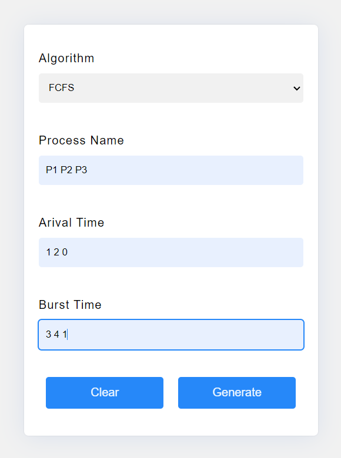
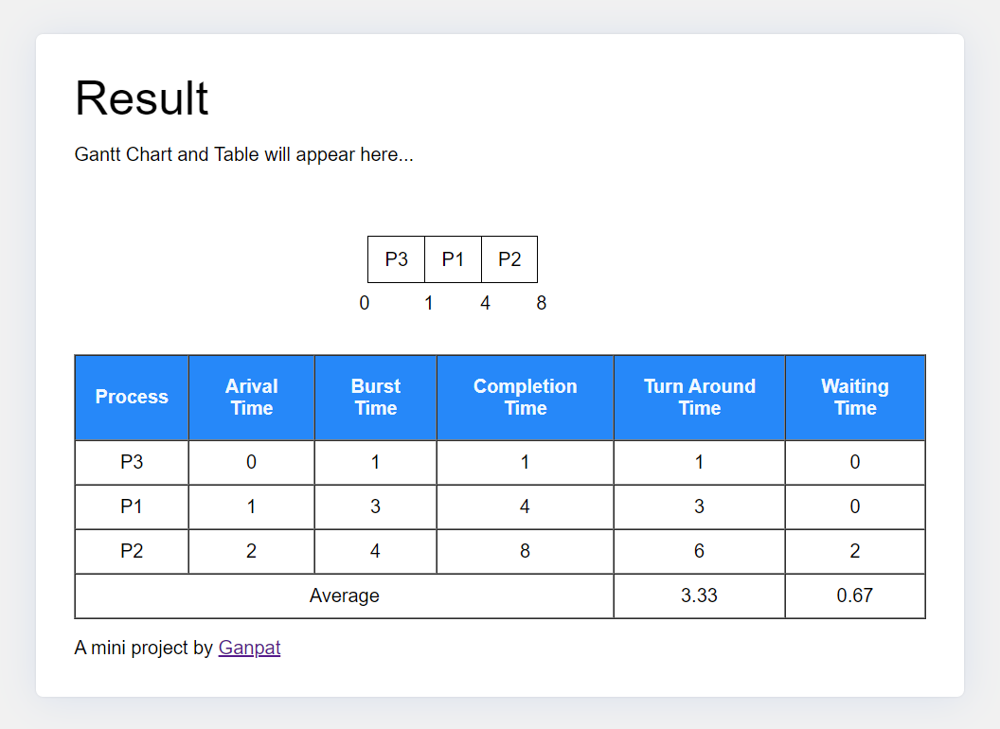

# Cpu Scheduler

## [Live Demo](https://imganpat.github.io/Cpu-Scheduler/)

## Project overview

The CPU Scheduler is a web-based tool that simulates CPU scheduling algorithms by accepting inputs such as arrival time, process name, and burst time. The tool generates a Gantt chart and a result table, allowing users to visualize the scheduling process and analyze the performance of different scheduling algorithms.

## Features

- <b> Input Handling:</b> Accepts arrival time, process name, burst time, and other relevant data.
- <b>Gantt Chart Generation:</b> Visual representation of the process execution order.
- <b>Result Table:</b> Displays key metrics like turnaround time, waiting time, etc.

## Usage

- Select the scheduling algorithm you wish to simulate.
- Enter the arrival time, process name, burst time, and any other required fields in the input form.
- Click on the "Generate" button to create the Gantt chart and result table.
- Analyze the results displayed on the screen.

